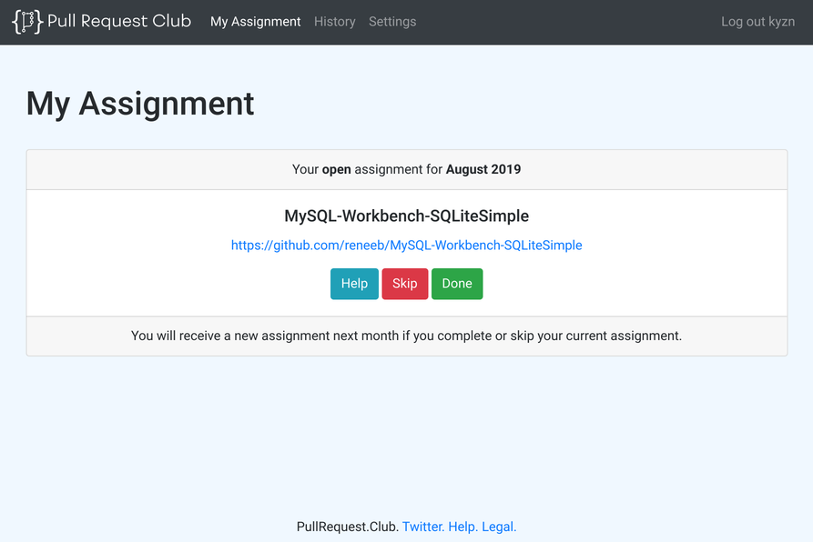

# PullRequest.Club

Pull Request Club is a web application written with Perl on Catalyst
Framework. Users can sign up with their GitHub accounts, and do two things:
- Receive monthly assignments, and
- Let system assign their repositories to other participants.

If you are looking for an open source project to work on, or if you are
looking for some help for your open source project, Pull Request Club might
be able to help. Give it a try at
[PullRequest.Club](https://pullrequest.club).

# Development

We are always looking forward to your contributions.
- [Code of Conduct](CODE_OF_CONDUCT.md)
- [Contributing](CONTRIBUTING.md)

See [wiki](https://github.com/kyzn/PRC/wiki) for further development instructions.

# License

MIT. See License file in repository.

# Author

Kivanc Yazan

# Contributors

- Andrew Grangaard
- E. Choroba
- Karen Etheridge
- Thibault Duponchelle
